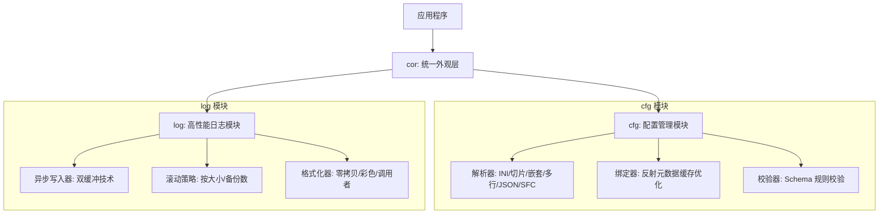

# Cog

Cog 是一个高性能、轻量级的 Go 核心基础库，旨在为应用程序提供极致性能的日志系统、灵活的配置管理以及统一的外观模式（Facade）接入。

## 核心架构

Cog 采用分层设计，确保各模块职责清晰且高度可复用：



## 模块功能与技术要点

### 1. 极致性能日志 (log)
- **高性能写入**: 采用双缓冲异步写入（Double Buffering）技术，通过 `sync.Cond` 实现生产者-消费者模型，大幅减少 IO 阻塞。
- **内存优化**: 关键路径使用 `sync.Pool` 管理字节缓冲区，结合 `strconv.Append` 等非分配 API 实现极致低分配。
- **无锁等级过滤**: 日志等级检查采用 `sync/atomic` 原子操作，读取开销极低。
- **结构化日志**: 支持 `WithFields` 链式调用，提供强类型的上下文记录。
- **灵活输出**: 支持多输出流（Streams），可同时输出到控制台、多个文件，并支持各自独立的级别和颜色配置。
- **自动滚动**: 内置 `rotator` 支持按文件大小自动切割及多版本备份管理。
- **溢出策略**: 异步模式支持 `BlockUntilDrained` / `DropNewest` / `DropOldest` 三种缓冲区溢出策略。

### 2. 灵活配置管理 (cfg)
- **无锁读取**: 基于 **Copy-On-Write (CoW)** 模式，通过 `atomic.Value` 实现配置的秒级热交换，读取操作完全无锁。
- **多格式解析**: 支持 INI、SFC (YAML-like)、JSON 三种格式，自动检测文件类型。
- **INI 切片语法**: 支持 `[[section]]` 双括号语法定义配置切片，适用于多服务、多输出流等场景。
- **环境变量扩展**: 支持 `${VAR:default}` 语法，`cor.Init` 自动调用 `ExpandEnv()` 展开所有环境变量。
- **高性能绑定**: `Bind` 功能引入**反射元数据缓存**，规避了原生反射重复扫描结构体的开销；支持结构体、标量指针（`*string`、`*int` 等）一键绑定。
- **Schema 校验**: 提供强类型的规则校验机制，支持必填项、类型检查、数值范围、正则匹配及自定义校验。

### 3. 统一外观模式 (cor)
- **单例内核**: `Kernel` 管理所有组件生命周期，支持组件化注册。
- **一键集成**: 通过 `cor.Init("config.cfg")` 自动完成配置加载、环境变量展开、日志初始化。
- **环境预设**: 自动注入 `EXE_DIR` / `CONF_DIR` 环境变量，简化跨平台部署。
- **组件化**: 实现 `Component` 接口即可注册自定义组件，随内核统一初始化与关闭。

## 快速上手

### 初始化
```go
import "ojv/cog/cor"

func main() {
    if err := cor.Init("app.cfg"); err != nil {
        panic(err)
    }
    defer cor.Close()
    
    cor.Info("Cog 系统启动成功")
}
```

### 配置绑定与校验
```go
type ServerOpts struct {
    Host string `cfg:"host"`
    Port int    `cfg:"port"`
}

var opts ServerOpts
cor.Bind("server", &opts)

// 标量绑定
var host string
var port int
cor.ConfigInstance().Bind("server.host", &host)
cor.ConfigInstance().Bind("server.port", &port)
```

### 结构化日志
```go
log.DefaultLogger().WithFields(log.Fields{
    "trace_id": "8888",
    "user":     "admin",
}).Infof("处理请求: %s", action)
```

### 配置文件示例
```ini
# 全局设置
app.name = MyDemo
app.version = 1.0.0

# 传统节
[server]
    host = 0.0.0.0
    port = 8080

# 切片语法 (双括号)
[[log.streams]]
    type = console
    level = debug
    color = true

[[log.streams]]
    type = file
    level = warn
    file = ./logs/app.log

# 环境变量扩展
database.password = ${DB_PWD:secret123}
```

## 目录结构
- `cfg/`: 配置解析、CoW 存储、反射缓存绑定、Schema 校验。
- `log/`: 异步双缓冲写入、自动滚动、结构化日志、溢出策略。
- `cor/`: 内核管理、外观模式封装、自动初始化、组件注册。
- `cmd/`: 模块示例与集成演示。

## 许可证
[MIT License](LICENSE)
