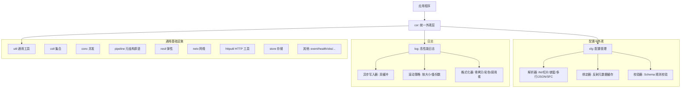

# Cog

Cog 是一个高性能、轻量级的 Go 核心基础库，提供配置管理、日志系统、统一外观，以及一组跨多个上层模块复用的通用基础设施（集合、并发、网络、弹性、存储、进程管理、元结构原语等）。

> 命名说明：**Cog = Core Of Go**。在本项目中，Cog 表示 Go 应用的核心基础设施层，承载被多个上层模块（slm / cofo / colm / coki 等）共享复用的结构性通用能力，不耦合任何具体业务领域。

## 核心架构

Cog 采用分层设计，确保各模块职责清晰且高度可复用：



## 模块清单

Cog 共 20 个子包，按职责分组：

### 配置与外观

- **cfg**: 配置管理（CoW 热交换、多格式解析、反射缓存绑定、Schema 校验）
- **cor**: 统一外观层（内核管理、组件化注册、自动初始化）
- **log**: 高性能日志（异步双缓冲、自动滚动、结构化、溢出策略）

### 集合与并发

- **coll**: 通用线程安全集合（Deque / Set / RingBuffer / Stack）
- **conc**: 并发原语（WorkerPool / Queue / QueueLf / Batch）

### 元结构与编排原语

- **pipeline**: 通用元结构原语（Chain / SafeCall / FanOut / HookChain / ValidationChain），全泛型零 interface{} 装箱

### 弹性与调度

- **resil**: 弹性模式（Retry / RetryHTTP / Backoff / RateLimiter / Fallback）
- **sched**: 调度与时间（CronScheduler / CronParser / 时间工具）

### 网络与协议

- **netx**: 网络扩展（HTTPClient / HttpGet/Post/Put 等 / WSConnection / Net 工具）
- **httputil**: HTTP 服务端工具（ApiResponse 信封 / 中间件链 / 响应辅助）
- **jsonrpc**: JSON-RPC 2.0 协议原语（Request/Response/Notification + 双向 Conn）
- **health**: 健康检查（Liveness / Readiness Probe）

### 数据与存储

- **store**: 持久化与缓存（DbLite / SegmentedWAL / Cache）
- **dafe**: CSV 结构映射（Reader[T] / Writer[T] 反射映射）
- **num**: 数值工具（Decimal 定点小数 / Bytes / Range）

### 进程与 Shell

- **procmgmt**: 跨平台进程组管理（SetPgid / KillGroup，posix/windows 分文件）
- **shell**: 跨平台命令执行（Cmd / OutputStream / CommandQueue / WorkflowStateMachine）

### 可观测性

- **event**: 发布订阅事件总线（EventHub，同步/异步/批量订阅、中间件、指标）
- **obs**: 可观测性聚合（汇总 netx / event / store 的运行时统计到单一 Snapshot）

### 通用工具

- **util**: 通用工具集（Args / Assert / Caller / CSV / DeepCopy / File / ID / Ignore / JSONL / Metrics / Pagination / PathUtil / Sanitize / SecureToken / Strings / Truncation / Utils / Validate）

## 模块功能与技术要点

### 1. 极致性能日志 (log)
- **高性能写入**: 采用双缓冲异步写入（Double Buffering）技术，通过 `sync.Cond` 实现生产者-消费者模型，大幅减少 IO 阻塞。
- **内存优化**: 关键路径使用 `sync.Pool` 管理字节缓冲区，结合 `strconv.Append` 等非分配 API 实现极致低分配。
- **无锁等级过滤**: 日志等级检查采用 `sync/atomic` 原子操作，读取开销极低。
- **结构化日志**: 支持 `WithFields` 链式调用，提供强类型的上下文记录。
- **灵活输出**: 支持多输出流（Streams），可同时输出到控制台、多个文件，并支持各自独立的级别和颜色配置。
- **自动滚动**: 内置 `rotator` 支持按文件大小自动切割及多版本备份管理。
- **溢出策略**: 异步模式支持 `BlockUntilDrained` / `DropNewest` / `DropOldest` 三种缓冲区溢出策略。

### 2. 灵活配置管理 (cfg)
- **无锁读取**: 基于 **Copy-On-Write (CoW)** 模式，通过 `atomic.Value` 实现配置的秒级热交换，读取操作完全无锁。
- **多格式解析**: 支持 INI、SFC (YAML-like)、JSON 三种格式，自动检测文件类型。
- **INI 切片语法**: 支持 `[[section]]` 双括号语法定义配置切片，适用于多服务、多输出流等场景。
- **环境变量扩展**: 支持 `${VAR:default}` 语法，`cor.Init` 自动调用 `ExpandEnv()` 展开所有环境变量。
- **高性能绑定**: `Bind` 功能引入**反射元数据缓存**，规避了原生反射重复扫描结构体的开销；支持结构体、标量指针（`*string`、`*int` 等）一键绑定。
- **Schema 校验**: 提供强类型的规则校验机制，支持必填项、类型检查、数值范围、正则匹配及自定义校验。

### 3. 统一外观模式 (cor)
- **单例内核**: `Kernel` 管理所有组件生命周期，支持组件化注册。
- **一键集成**: 通过 `cor.Init("config.cfg")` 自动完成配置加载、环境变量展开、日志初始化。
- **环境预设**: 自动注入 `EXE_DIR` / `CONF_DIR` 环境变量，简化跨平台部署。
- **组件化**: 实现 `Component` 接口即可注册自定义组件，随内核统一初始化与关闭。

### 4. 元结构原语 (pipeline)
- **Chain[F]**: 装饰器中间件链，按序组合 F→F 转换。
- **SafeCall / SafeCallRecover**: panic 安全调用，捕获并将 panic 转为 error。
- **FanOut[T]**: 多消费者事件扇出，每个消费者独立 goroutine。
- **HookChain[T]**: 可中断 hook 链，任一 hook 返回 false 即停止后续。
- **ValidationChain[T]**: collect-all 校验链，收集所有错误而非短路。
- 全泛型实现，避免 `interface{}` 装箱；被 cofo/flow 等多个上层包复用。

### 5. 弹性模式 (resil)
- **Retry**: 泛型重试，指数退避 + context 取消。
- **RetryHTTP**: HTTP 专用重试，按状态码和方法过滤。
- **Backoff**: 可插拔退避策略（指数退避 + 可选 jitter）。
- **RateLimiter**: 令牌桶限流器，含全局实例注册表。
- **Fallback**: 有状态故障转移，连续失败 N 次后切换到备份操作；与 Retry 正交（Retry 同资源重试，Fallback 跨资源切换）。

### 6. 持久化与缓存 (store)
- **DbLite**: 内嵌 KV 存储，JSON 持久化。
- **SegmentedWAL**: 分段写前日志，支持轮转、后台 sync/merge、崩溃恢复、内存缓存。
- **Cache**: 内存缓存，TTL + 驱逐回调 + janitor 清理。

### 7. JSON-RPC 2.0 (jsonrpc)
- 提供 Request / Response / Notification / Error 消息模型和双向 `Conn`。
- 修复了常见 LSP/MCP 实现的若干缺陷：ctx 取消时清理 pending map、`Call` 返回保留服务端 Code 的 `*Error`、`readLoop` 可被 `Close` 中断、`OnNotification` 真正被调用。

### 8. 跨平台进程管理 (procmgmt) 与 Shell
- **procmgmt**: `SetPgid` / `KillGroup` 跨平台抽象，posix 用 setpgid/kill(-pgid)，windows 用 taskkill /T /F。
- **shell**: `Cmd` 异步命令执行器，支持超时/context、流式输出（`OutputStream` / `OutputBuffer`）、多步编排（`CommandQueue` / `WorkflowStateMachine`）。

## 快速上手

### 初始化
```go
import "ojv/cog/cor"

func main() {
    if err := cor.Init("app.cfg"); err != nil {
        panic(err)
    }
    defer cor.Close()

    cor.Info("Cog 系统启动成功")
}
```

### 配置绑定与校验
```go
type ServerOpts struct {
    Host string `cfg:"host"`
    Port int    `cfg:"port"`
}

var opts ServerOpts
cor.Bind("server", &opts)

// 标量绑定
var host string
var port int
cor.ConfigInstance().Bind("server.host", &host)
cor.ConfigInstance().Bind("server.port", &port)
```

### 结构化日志
```go
log.DefaultLogger().WithFields(log.Fields{
    "trace_id": "8888",
    "user":     "admin",
}).Infof("处理请求: %s", action)
```

### 元结构原语
```go
import "ojv/cog/cam/pipeline"

// 装饰器链
handler := pipeline.Chain(func(s string) error {
    return process(s)
}, loggingMiddleware, tracingMiddleware)

// panic 安全调用
err := pipeline.SafeCallRecover(func() {
    riskyOperation()
})

// 多消费者扇出
fan := pipeline.NewFanOut[int](3)
fan.Emit(42) // 所有消费者都会收到
```

### 配置文件示例
```ini
# 全局设置
app.name = MyDemo
app.version = 1.0.0

# 传统节
[server]
    host = 0.0.0.0
    port = 8080

# 切片语法 (双括号)
[[log.streams]]
    type = console
    level = debug
    color = true

[[log.streams]]
    type = file
    level = warn
    file = ./logs/app.log

# 环境变量扩展
database.password = ${DB_PWD:secret123}
```

## 目录结构

- `cfg/`: 配置解析、CoW 存储、反射缓存绑定、Schema 校验
- `log/`: 异步双缓冲写入、自动滚动、结构化日志、溢出策略
- `cor/`: 内核管理、外观模式封装、自动初始化、组件注册
- `coll/`: 线程安全集合（Deque / Set / RingBuffer / Stack）
- `conc/`: 并发原语（WorkerPool / Queue / QueueLf / Batch）
- `pipeline/`: 元结构原语（Chain / SafeCall / FanOut / HookChain / ValidationChain）
- `resil/`: 弹性模式（Retry / Backoff / RateLimiter / Fallback）
- `sched/`: 调度与时间（CronScheduler / CronParser / 时间工具）
- `netx/`: 网络扩展（HTTPClient / WebSocket / Net 工具）
- `httputil/`: HTTP 服务端工具（ApiResponse / 中间件链）
- `jsonrpc/`: JSON-RPC 2.0 协议原语（Conn 双向连接）
- `health/`: 健康检查（Liveness / Readiness Probe）
- `store/`: 持久化与缓存（DbLite / SegmentedWAL / Cache）
- `dafe/`: CSV 结构映射（Reader[T] / Writer[T]）
- `num/`: 数值工具（Decimal / Bytes / Range）
- `procmgmt/`: 跨平台进程组管理（SetPgid / KillGroup）
- `shell/`: 跨平台命令执行（Cmd / OutputStream / Workflow）
- `event/`: 发布订阅事件总线（EventHub）
- `obs/`: 可观测性聚合（ObservabilitySnapshot）
- `util/`: 通用工具（Args / Assert / Caller / CSV / DeepCopy / File / ID / Ignore / JSONL / Metrics / Pagination / PathUtil / Sanitize / SecureToken / Strings / Truncation / Utils / Validate）
- `cmd/`: 模块示例与集成演示

## 许可证
[MIT License](LICENSE)
